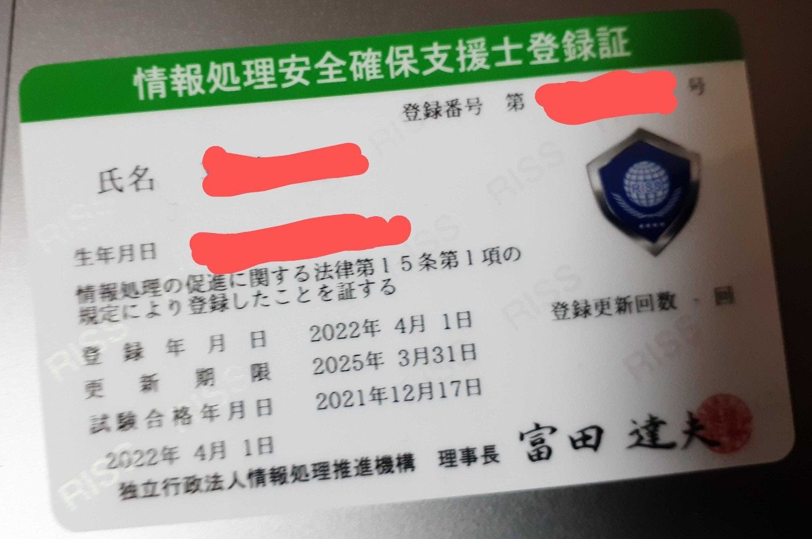

# 2022年春期 情報処理安全確保支援士試験 午後Ⅰを解いた

実は去年の情報処理安全確保支援士試験を受けていて，無事合格して登録セキスペになりました．

ただ，去年は試験を受けた後余裕がなくて，特に午後試験を自己採点するなんてことは怖くてできませんでした．
その点今年は余裕があるので，予め解答を残しておいて，IPA解答が出たときに自己採点などして楽しもうと思います．

問題は下記URLにあります．
https://www.jitec.ipa.go.jp/1_04hanni_sukiru/mondai_kaitou_2022r04.html#04haru

情報処理安全確保支援士試験は，[ITスキル標準](https://www.ipa.go.jp/jinzai/itss/itss7.html)基準でlv4に区分されます．
これは情報処理技術者試験の中では一番高いレベルで，ある程度の基礎知識は要求されます．
しかし，日本語力の比重もかなりあるように感じていて，日本語力があればある程度解けてしまう面もあります．
ぜひ挑戦．．．．は面倒でも，今年の問題と下記解答を見比べてみてください．

以下解答です．
ところどころコメントをはさみます．

## 問1

設問1
(1) イ

> 調べると分かるのですが間違ってます．正解はアです．
> パーセントエンコーディングされた改行文字を選べば正解になるので実質2択なのですが，50%を外しましたね．．．． 

(2) プレースホルダ
(3) 改行文字

設問2

(1) 情報選択機能で，クエリ文字列内のプロジェクトIDを書き換える
(2) セッション情報を利用者が書き換えることはできないため

> サーバ側で管理されるので利用者が参照・書き換えができない旨を書こうかと思ったのですが，
> 最近だとクッキーに署名を施したセッション情報を格納することもあり，必ずしもそうとは言えないのでこのような解答にしました．

(3) エ
(4) stmt

設問3
情報番号 = ? and プロジェクトID = ?

## 問3

設問1 a. イ, b. ア
設問2

(1)

* 口座振替登録に必要な情報を入手し，アカウントとひも付ける．
* 他人に口座振替登録用のWeb画面を開かせ，情報を入力させる．

> 自信ないです．
> 他人の口座と紐づけるためには，口座振替登録用のWeb画面で
> 
> * キャッシュカードの暗証番号
> * 口座番号
> 
> の2点が必要です．そうなると
> 
> * 頑張って入手する
> * 攻撃対象にメールを送り付けるなどして本人に入力させる
> 
> の2択だと思ったのでこのような解答にしました．

(2) 証明写真

> 本人確認の手段として「証明写真付きの本人確認書類」を求められることはよくあるよな．．．．と思ったので素直にそのように書きました．

(3) d. ウ e. イ
(4) アカウントの氏名が正しいこと
> シンプルに自信がない．アカウント作成時に入力した氏名が本人のものと一致することを確認したい
> という意図で間違ってはないと思います．それが伝わるように，もう少し詳細に書きたかったのですが，文字数制限が結構厳しかったですね．

(5) スマートフォンのカメラ機能で，数字を記入した紙とともに自身を撮影

> 某掲示板で似たような手法がよく使われてたと思います．こんなところで役に立つとは思いませんでした．

設問3

(1) スマートフォンが他人の手に渡ったとき
(2) 一定時間操作がなかった場合，PINコードを入力させる

> 画面ロックの設定がされていなかった場合，スマートフォンが他人の手にわたっていて，かつログイン状態だと不都合が生じます．(例えば他人の口座で決済し放題になります)
> 「ログイン状態を一週間保持」とあるので，それ以外の方法で他人が操作を行えないようにする必要があるのだと考えました．
> そういえばLINEは予め設定したPINコードを入力させる設定ができるよなー．．．．という気持ちでこのような解答にしました．

